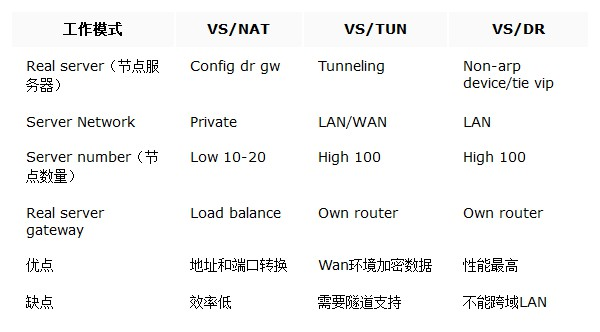
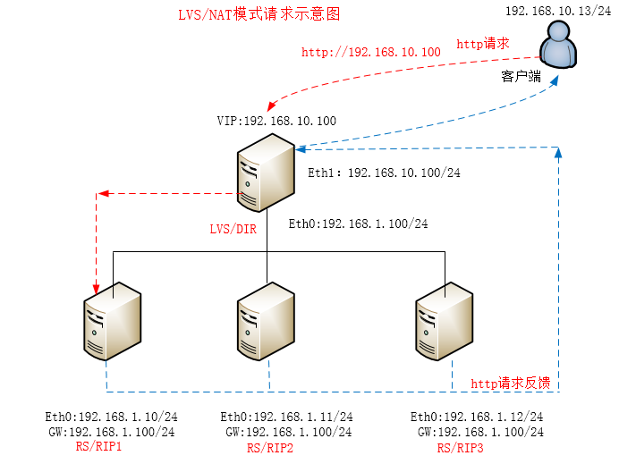
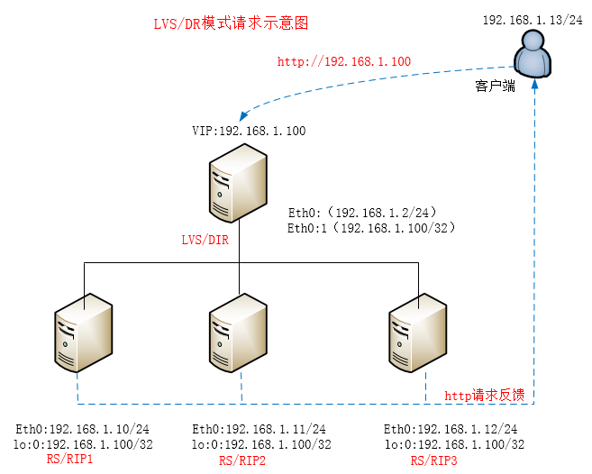

# 三种负载均衡



## NAT


- 概念

LVS-NAT模式主要是将客户单发送过来的包目标地址更改为后端RIP的ip，主要把三层的信息做了更改，其他都不变，此配置下后端RIP不需要做任何配置，但必须保证RIP的网关必须为与RIP相连的DIR接口ip，因为LVS-NAT主要用到DNAT和SNAT原理

- 流量详情
```
1. 当用户请求到达Director Server，此时请求的数据报文会先到内核空间的PREROUTING链。 此时报文的源IP为CIP，目标IP为VIP 
2. PREROUTING检查发现数据包的目标IP是本机，将数据包送至INPUT链
3. IPVS比对数据包请求的服务是否为集群服务，若是，修改数据包的目标IP地址为后端服务器IP，然后将数据包发至POSTROUTING链。 此时报文的源IP为CIP，目标IP为RIP
4. POSTROUTING链通过选路，将数据包发送给Real Server
5. Real Server比对发现目标为自己的IP，开始构建响应报文发回给Director Server。 此时报文的源IP为RIP，目标IP为CIP 
6. Director Server在响应客户端前，此时会将源IP地址修改为自己的VIP地址，然后响应给客户端。 此时报文的源IP为VIP，目标IP为CIP
```
- 模式特点
```
RS和DIP属于同一IP网络中网卡应该使用私网地址，且RS的网关要指向DIP
请求和响应报文都要经由director转发；极高负载的场景中，director可能会成为系统瓶颈
vip需要配置在DIR接受客户端请求网卡上，且直接对外提供服务
```

## DR

- 概念
  
每个Real Server上都有两个IP：VIP和RIP，但是VIP是隐藏的，就是不能提高解析等功能，只是用来做请求回复的源IP的，Director上只需要一个网卡，然后利用别名来配置两个IP：VIP和DIP，在DIR接收到客户端的请求后，DIR根据负载算法选择一台rs sever的网卡mac作为客户端请求包中的目标mac，通过arp转交给后端rs serve处理，后端再通过自己的路由网关回复给客户端

- 模式特点
```
RIP上要把vip配置在lo口以及要仰制arp查询和响应
RIP 必须与 DIP 在同一个网络中(相同的广播域)
RS 的 RIP 可以使用私有地址，也可以使用公网地址
```


## TUN


- 概念
  
LVS/TUN模式就是利用ip tunnel技术原理，在不改变原有的ip包头首部信息的基础上再封装一层ip首部信息，再利用路由的原理将请求转交给后端RS server，所以所有的server都必须支持ip tunnel隧道 ，相比LVS/DR模式，LVS/TUN对网络的消耗比较大，因为要支持ip tunnel的开销，所以这也是为什么DR模式是三种模式中效率最高的一种模式

- 模式特点
```
RIP上要把vip配置在lo口以及要仰制arp查询和响应
RIP 必须与 DIP 在同一个网络中(相同的广播域)
RS 的 RIP 可以使用私有地址，也可以使用公网地址
```
